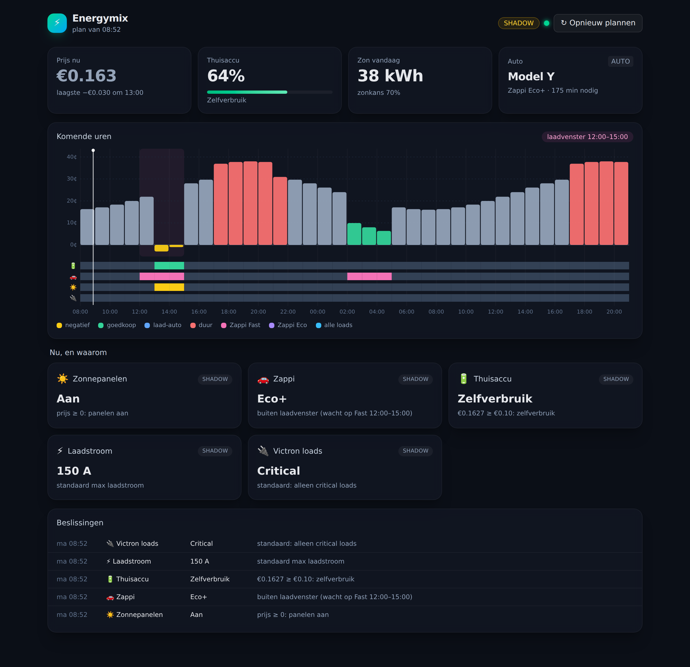

# Energymix

Home Assistant add-on die je energiehuishouding plant op basis van Tibber-prijzen:
Victron thuisaccu (ESS / DVCC / feed-in), zonnepanelen-curtailment en Zappi-laden.
Eén planner in plaats van losse Node-RED-regels, met een dashboard dat per tijdslot laat
zien wat hij doet en waarom.



## Installeren

1. Instellingen → Add-ons → Add-on Store → ⋮ → **Repositories**
2. Voeg `https://github.com/riemers/energymix` toe
3. Installeer **Energymix**, vul de opties in en start. Hij begint in shadow mode.

Zie [energymix/DOCS.md](energymix/DOCS.md) voor de opties en beslisregels.

## Architectuur

```
Collector (HA websocket) ──► Planner (puur, per tijdslot) ──► Executor (alleen live onderdelen)
         Tibber API ─┘                 │                         ├─ HA services (Envoy, Zappi)
                                       └─ SQLite (plan, log)     └─ MQTT (Victron)
Web-UI: React via HA Ingress (zijbalk) of poort 8099
```

## Ontwikkelen

```bash
pip install -r energymix/requirements.txt pytest pytest-asyncio
pytest                                    # planner-tests (incl. wintertijd, kwartierprijzen)

cd energymix/frontend && npm install && npm run build
cd ../app && python -m energymix.demo     # UI met nepdata op http://localhost:8099
# of tegen je echte HA: ENERGYMIX_OPTIONS=../../local/options.json python -m energymix
#   (met ha_url + ha_token in die options.json)
cd ../frontend && npm run dev             # hot reload, proxyt /api naar :8099
```
